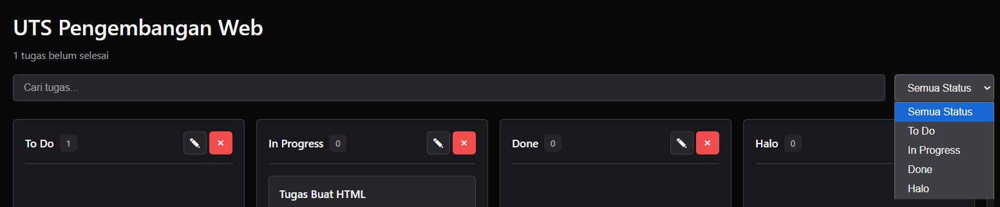

# Aplikasi Manajemen Tugas Mahasiswa

Aplikasi web buat bantu mahasiswa ngatur tugas-tugas kuliah dengan sistem kanban board yang gampang dipake.

## Deskripsi

Buat kamu yang sering kelupaan tugas atau bingung mau ngerjain tugas mana dulu, aplikasi ini bisa jadi solusinya. Pake konsep kanban board kayak di Trello atau Notion, tapi lebih simpel dan langsung bisa dipake tanpa ribet. Semua data disimpan di browser kamu sendiri, jadi aman dan gak perlu koneksi internet.

## Fitur-Fitur

### Fitur Utama (Sesuai Requirement Tugas)

**1. Kelola Project**


- Bikin project baru dengan nama dan deskripsi
- Edit info project kapan aja
- Hapus project kalau udah gak kepake
- Tiap project punya kanban board sendiri

**2. Atur Kolom Kanban**


- Tambah kolom sebanyak yang kamu mau
- Ubah nama kolom sesuai kebutuhan
- Hapus kolom yang udah gak perlu
- Udah ada kolom default: To Do, In Progress, Done

**3. Manage Tugas**


- Tambahin tugas baru dengan detail lengkap:
  - Nama tugas (wajib isi, minimal 3 karakter)
  - Mata kuliah (wajib)
  - Deadline (wajib, dan gak boleh mundur ke masa lalu)
  - Deskripsi tugas (opsional)
- Edit tugas kalau ada yang salah
- Hapus tugas yang udah selesai atau gak jadi dikerjain
- Pindahin tugas antar kolom tinggal drag and drop aja

**4. Cari dan Filter**



- Cari tugas berdasarkan nama atau nama matkul
- Filter tugas berdasarkan kolom (bisa filter berdasarkan kolom apapun yang udah dibuat)
- Filter dinamis - otomatis update kalau ada kolom baru
- Hasil pencarian dan filter langsung keliatan real-time

**5. Info dan Statistik**

- Keliatan berapa tugas yang belum selesai per project
- Hitung otomatis jumlah tugas di tiap kolom
- Ada indikator deadline: tugas yang telat, deadline hari ini, atau masih lama
- Format tanggal yang gampang dibaca

**6. Validasi Input**


- Nama project minimal 3 karakter
- Nama tugas gak boleh kosong dan minimal 3 karakter
- Mata kuliah harus diisi
- Deadline gak boleh kosong dan gak boleh tanggal yang udah lewat
- Pesan error yang jelas kalau ada yang salah

**7. Penyimpanan Otomatis**


- Semua data otomatis kesimpan di localStorage browser
- Data langsung dimuat pas buka aplikasi
- Gak bakal kehilangan data meskipun browser ditutup
- Update real-time setiap ada perubahan

### Fitur Bonus

**8. Drag and Drop**

- Geser tugas dari satu kolom ke kolom lain dengan mouse
- Ada efek visual pas lagi drag
- Animasinya smooth dan gak ngadat

**9. Konfirmasi Hapus**


- Muncul popup konfirmasi sebelum hapus apapun
- Jadi gak bakal kehapus gak sengaja

**10. Responsive**  


- Tampilan oke di laptop, tablet, sama HP
- Layout otomatis nyesuain ukuran layar

**11. Dark Theme**

- Tema gelap yang nyaman buat mata
- Kontras warnanya pas, gak bikin pusing

## Teknologi

- **HTML5** - Struktur aplikasi
- **CSS3** - Styling pake CSS Variables
- **JavaScript Vanilla** - Logika aplikasi tanpa framework
- **localStorage** - Simpan data lokal

## Cara Pakai

### Jalanin Aplikasi

**Cara 1: Langsung Buka**

1. Download atau clone repo ini
2. Buka file `index.html` di browser (Chrome, Firefox, Edge, atau Safari)
3. Langsung bisa dipake deh

**Cara 2: Pake Live Server (Recommended)**

1. Install extension Live Server di VS Code
2. Klik kanan file `index.html`
3. Pilih "Open with Live Server"
4. Browser otomatis kebuka

### Panduan Penggunaan

**Bikin Project Baru**

1. Klik tombol "Tambah Project" di header
2. Isi nama project (minimal 3 karakter)
3. Isi deskripsi kalau mau (opsional)
4. Klik "Simpan"
5. Project baru bakal muncul di sidebar kiri

**Buka Project**

1. Klik nama project di sidebar
2. Kanban board bakal muncul dengan kolom default (To Do, In Progress, Done)

**Tambahin Kolom Baru**

1. Scroll ke kanan di kanban board
2. Klik tombol "Tambah Kolom"
3. Isi nama kolomnya
4. Klik "Simpan"
5. Kolom otomatis masuk ke dropdown filter

**Bikin Tugas Baru**

1. Klik tombol "Tambah Tugas" di bagian bawah kolom
2. Isi info tugasnya:
   - Nama tugas (wajib)
   - Mata kuliah (wajib)
   - Deadline (wajib)
   - Deskripsi (kalau perlu)
3. Klik "Simpan"

**Pindahin Tugas**

1. Klik dan tahan card tugas
2. Drag ke kolom yang dituju
3. Lepas buat drop
4. Otomatis kesimpan

**Edit Apapun**

1. Hover di item yang mau diedit (project, kolom, atau tugas)
2. Klik icon pensil
3. Edit yang perlu diubah
4. Klik "Simpan"

**Hapus Item**

1. Hover di item yang mau dihapus
2. Klik icon X
3. Konfirmasi hapus
4. Klik "Hapus"

**Cari dan Filter**

- **Cari**: Ketik aja di search box buat cari tugas berdasarkan nama atau mata kuliah
- **Filter**: Pilih kolom di dropdown buat nampilin kolom tertentu aja

## Detail Teknis

### Gimana Data Disimpan

Aplikasi pake localStorage browser buat nyimpan semua data. Struktur datanya kayak gini:

```javascript
{
    "projects": [
        {
            "id": "1697123456789",
            "name": "Nama Project",
            "description": "Deskripsi Project",
            "columns": [
                {
                    "id": "col1",
                    "name": "To Do",
                    "tasks": [
                        {
                            "id": "1697123456790",
                            "name": "Nama Tugas",
                            "course": "Nama Matkul",
                            "deadline": "2024-12-31T23:59",
                            "description": "Deskripsi Tugas",
                            "createdAt": "2024-10-12T10:30:00.000Z"
                        }
                    ]
                }
            ],
            "createdAt": "2024-10-12T10:00:00.000Z"
        }
    ],
    "currentProject": "1697123456789"
}
```

**Nyimpan Data:**

- Pake `localStorage.setItem('taskManagerData', JSON.stringify(data))`
- Dipanggil setiap kali ada perubahan (tambah, edit, hapus)
- Jadi datanya selalu update

**Ambil Data:**

- Pake `JSON.parse(localStorage.getItem('taskManagerData'))`
- Dipanggil pas aplikasi pertama kali dibuka
- Buat restore state terakhir

### Validasi Form

Setiap form ada validasinya biar datanya valid:

**Validasi Project**

- Nama gak boleh kosong
- Minimal 3 karakter
- Muncul pesan error kalau salah

**Validasi Tugas**

- Nama tugas gak boleh kosong, minimal 3 karakter
- Mata kuliah harus diisi
- Deadline harus diisi dan gak boleh tanggal yang udah lewat
- Tiap field ada pesan errornya sendiri

Contoh kode validasinya:

```javascript
validateTaskForm(name, course, deadline) {
    let isValid = true;

    if (!name.trim()) {
        nameError.textContent = 'Nama tugas gak boleh kosong';
        isValid = false;
    }

    const deadlineDate = new Date(deadline);
    if (deadlineDate < new Date()) {
        deadlineError.textContent = 'Deadline gak boleh tanggal yang udah lewat';
        isValid = false;
    }

    return isValid;
}
```

### Drag and Drop

Fitur drag and drop pake HTML5 Drag and Drop API:

```javascript
card.addEventListener("dragstart", (e) => {
  this.draggedTask = task;
  card.classList.add("dragging");
});

container.addEventListener("drop", (e) => {
  targetColumn.tasks.push(this.draggedTask);
  this.saveToLocalStorage();
});
```

### Arsitektur Kode

Aplikasi pake class-based architecture yang rapi:

- **TaskManager** - Class utama yang handle semua logika
- **Separation of concerns** - Tiap method punya tugas spesifik
- **Event delegation** - Buat performa yang optimal
- **Clean code** - Nama variable dan function yang jelas

## Design

### Warna

Pake skema warna monokromatik dengan hue 286 (ungu gelap):

- **Background**: oklch(0.14 0.00 286) - oklch(0.27 0.01 286)
- **Text**: oklch(0.87 0.01 286) - oklch(0.97 0.00 286)
- **Accent**: oklch(0.55 0.01 286)
- **Success**: oklch(0.70 0.15 150) - Hijau soft
- **Warning**: oklch(0.75 0.15 60) - Kuning soft
- **Destructive**: oklch(0.65 0.20 25) - Merah soft
- **Info**: oklch(0.70 0.15 250) - Biru soft

### Prinsip Design

- **Konsisten** - Border radius 5px di semua tempat
- **Minimalis** - Design bersih tanpa elemen yang gak perlu
- **Readable** - Kontras warna yang oke (WCAG AA compliant)
- **Responsive** - Tampilan nyesuain ukuran layar
- **Smooth** - Transisi dan animasi yang halus

### Inspirasi

Design terinspirasi dari shadcn/ui tapi diadaptasi pake vanilla CSS:

- Button dengan berbagai variant (primary, secondary, destructive)
- Form controls dengan focus states yang jelas
- Modal dengan backdrop blur
- Card components dengan hover effects

## Penilaian

| Aspek                                          | Bobot | Status |
| ---------------------------------------------- | ----- | ------ |
| Fungsionalitas lengkap (CRUD tasks)            | 30%   | Sudah  |
| Implementasi localStorage dan pengelolaan data | 20%   | Sudah  |
| Validasi form dan error handling               | 20%   | Sudah  |
| Fitur filter/pencarian dan statistik           | 15%   | Sudah  |
| Desain UI dan UX                               | 10%   | Sudah  |
| Dokumentasi dan kerapian kode                  | 5%    | Sudah  |

**Total**: 100%

## Struktur File

```
pertemuan1/
├── index.html    # Struktur HTML
├── styles.css    # Semua styling
├── script.js     # Logika JavaScript
└── README.md     # Dokumentasi ini
```

## Keamanan dan Privacy

- Data disimpan cuma di browser kamu sendiri (localStorage)
- Gak ada pengiriman data ke server manapun
- Data bersifat lokal dan private
- Ada XSS protection dengan escaping HTML

## Browser Support

Aplikasi udah ditest dan jalan lancar di:

- Chrome/Edge (versi terbaru)
- Firefox (versi terbaru)
- Safari (versi terbaru)
- Opera (versi terbaru)

## Tips

1. **Backup Data** - Export localStorage kamu secara berkala buat backup
2. **Organisasi** - Bikin project terpisah buat tiap semester
3. **Kolom Custom** - Bikin kolom sesuai workflow kamu (misal: "Review", "Waiting", dll)
4. **Deadline** - Set deadline lebih awal biar ada buffer waktu
5. **Deskripsi** - Manfaatin field deskripsi buat catatan detail tugas

## Pengembangan Kedepan

Fitur yang bisa ditambahin nanti:

- Export/Import data (JSON/CSV)
- Notifikasi deadline
- Subtasks dan checklist
- Tags dan labels
- Kalender view
- Statistik dan laporan
- Custom theme
- Kolaborasi multi-user

## Developer

**Muhammad Yusuf**

- Portfolio: [wupxy-v2.vercel.app](https://wupxy-v2.vercel.app/)
- Tahun: 2025

## Lisensi

Aplikasi ini dibuat buat keperluan tugas kuliah dan pembelajaran.

---

**Note**: localStorage browser punya batasan penyimpanan sekitar 5-10MB. Kalau pakenya intensif dengan banyak data, mending export data secara berkala buat jaga-jaga.
