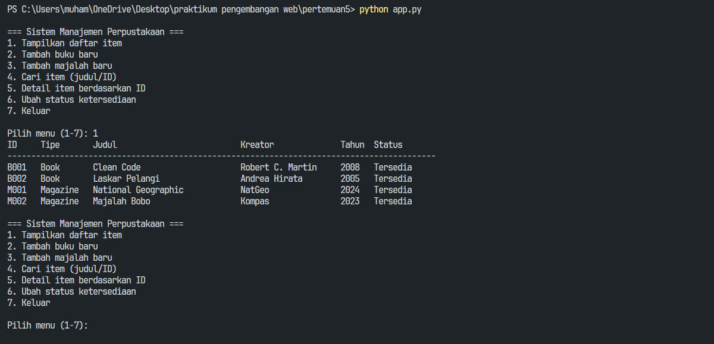
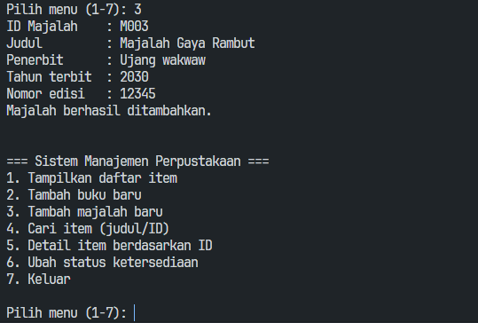
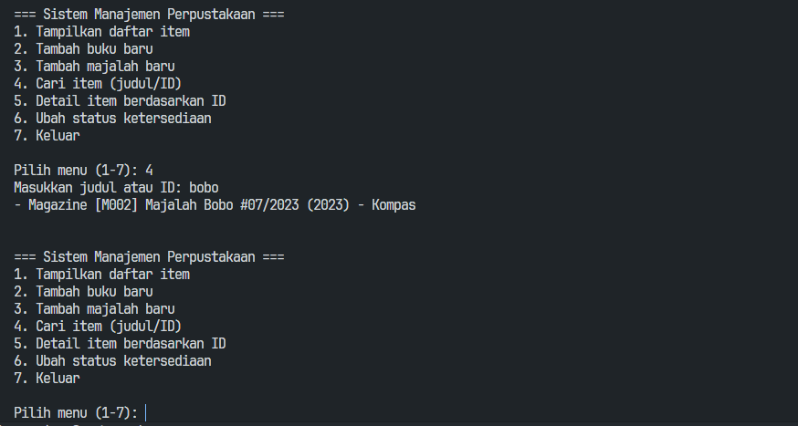
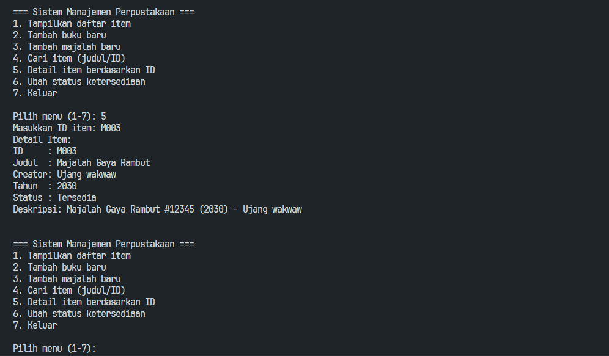
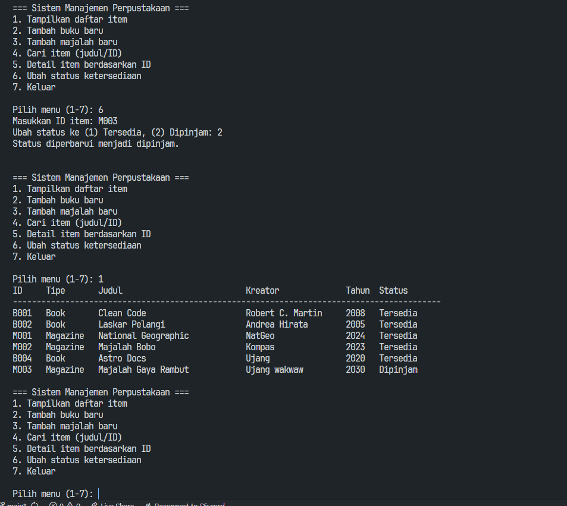
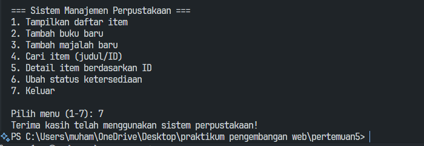
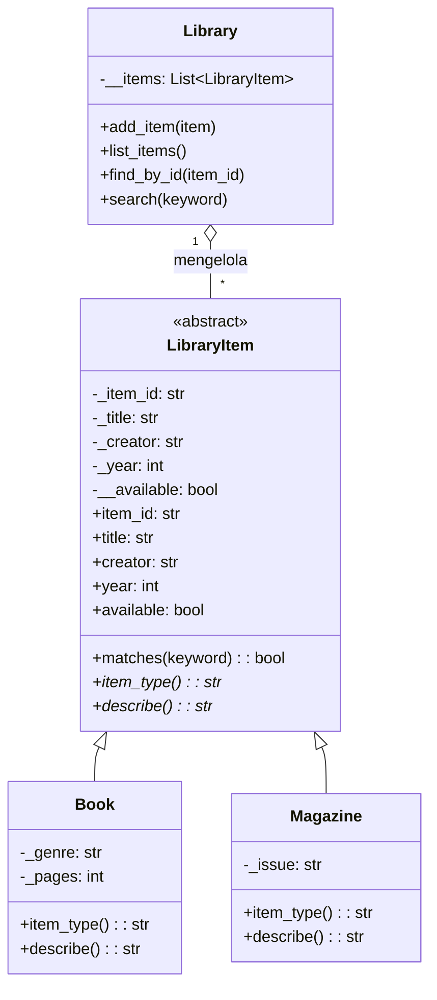

# Sistem Manajemen Perpustakaan

Implementasi praktikum Python OOP pertemuan 5. Proyek ini memanfaatkan abstract class, inheritance, encapsulation, dan polymorphism untuk mengelola koleksi item perpustakaan.

## Fitur Utama
- `LibraryItem` sebagai abstract class dengan properti terenkapsulasi (`available`) dan metode abstrak (`item_type`, `describe`).
- Subclass konkrit `Book` dan `Magazine` yang meng-override metode abstrak sehingga menunjukkan polymorphism.
- `Library` sebagai pengelola koleksi menggunakan enkapsulasi daftar item dan menyediakan operasi tambah, cari, serta lihat detail.
- CLI (`app.py`) dengan menu interaktif untuk menambah item, menampilkan daftar, mencari, dan mengubah status ketersediaan.

## Struktur Berkas
```
pertemuan5/
|-- app.py              # Entry point CLI
|-- library.py          # Kelas Library dan logika koleksi
|-- models/
|   |-- __init__.py     # Ekspor class untuk kemudahan import
|   |-- base.py         # Abstract class LibraryItem
|   \-- items.py        # Subclass Book dan Magazine
\-- README.md
```

## Cara Menjalankan
1. Buka terminal pada folder `pertemuan5`.
2. Jalankan `python app.py`.
3. Ikuti menu yang tersedia untuk mencoba fitur tambah item, pencarian, update status, dan keluar dari aplikasi.

## Menu Program
- `1. Tampilkan daftar item` &mdash; Menampilkan seluruh koleksi saat ini lengkap dengan tipe, kreator, tahun, dan status ketersediaan.
- `2. Tambah buku baru` &mdash; Menginput detil buku (ID, judul, penulis, tahun, genre, halaman) lalu menambahkannya ke koleksi.
- `3. Tambah majalah baru` &mdash; Mirip menu 2 namun untuk majalah dengan data penerbit dan nomor edisi.
- `4. Cari item (judul/ID)` &mdash; Melakukan pencarian bebas berbasis substring judul atau kecocokan ID.
- `5. Detail item berdasarkan ID` &mdash; Menampilkan informasi lengkap satu item termasuk deskripsi `describe()`.
- `6. Ubah status ketersediaan` &mdash; Mengganti flag `available` menjadi tersedia/dipinjam untuk mempraktekkan encapsulation melalui property.
- `7. Keluar` &mdash; Menutup aplikasi secara bersih.

## Screenshot Program








## Diagram Class
Gunakan diagram Mermaid berikut untuk menggambarkan relasi antar class:


